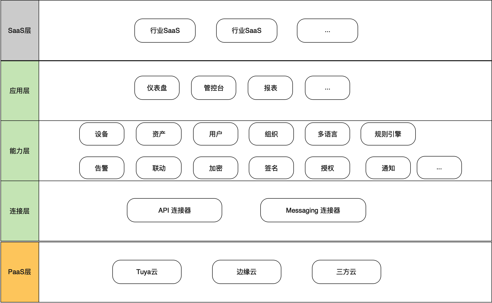
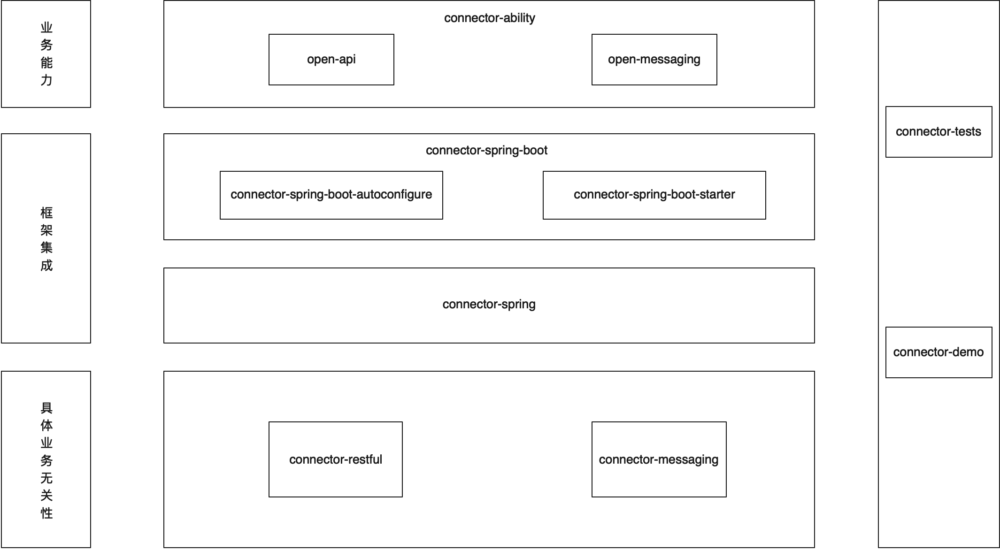
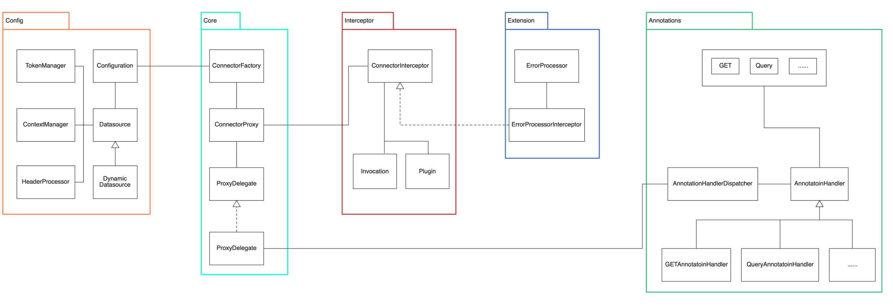
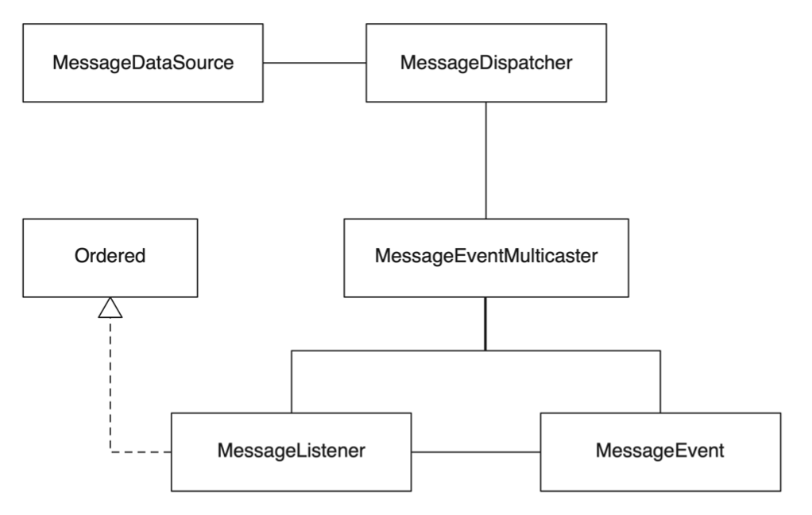

# connector-framework

### 快速开始
#### SpringBoot集成
##### 依赖
```xml
<dependency>
  <groupId>com.tuya</groupId>
  <artifactId>connector-spring-boot-starter</artifactId>
  <version>${latest.version}</version>
</dependency>
```
##### 配置
```
# required
connector.api.base-url=http://localhost:8080
```
##### 使用

1. 定义Connector接口
```java
public interface EchoConnector {
    @GET("/test/springboot/echo/{s}")
    String echo(@Path("s") String s);
}
```

2. Application启动类添加Connector扫描路径
```java
@ConnectorScan(basePackages = "org.connector.api.demo.localdemo.connectors")
@SpringBootApplication
public class DemoApplication {
    public static void main(String[] args) {
        SpringApplication.run(DemoApplication.class, args);
    }
}
```

3. 直接注入Connector即可调用
```java
@RestController
public class EchoController {
    @Autowired
    private EchoConnector connector;

    @RequestMapping("/echo/{s}")
    public String echo(@PathVariable String s) {
        return connector.echo(s);
    }
}
```
#### maven项目
##### 依赖
```xml
<dependency>
  <groupId>com.tuya</groupId>
  <artifactId>connector-api</artifactId>
  <version>${latest.version}</version>
</dependency>
```
##### 使用

1. 定义Connector接口
```java
public interface EchoConnector {
    @GET("/test/springboot/echo/{s}")
    String echo(@Path("s") String s);
}
```

2. 创建配置 -> 初始化工厂 -> 加载Connector接口
```java
// 初始化配置类
Configuration config = new Configuration();
ApiDataSource dataSource = ApiDataSource.DEFAULT_BUILDER.build();
dataSource.setBaseUrl("http://localhost:8080");
config.setDataSource(dataSource);

// 基于配置创建Connector工厂
ConnectorFactory connectorFactory = new DefaultConnectorFactory(config);

// 从工厂加载Connector接口
connector = connectorFactory.loadConnector(EchoConnector.class);
```
### 架构设计
#### IoTSaaSFramework分层

#### 整体架构

#### connector-restful
核心思想是基于注解的声明式API调用，类似MyBaits的Mapper接口声明机制，通过框架对Connector接口进行代理实现具体的请求过程。
框架底层的Http调用目前的实现是委托给Retrofit2（底层依赖OhHttpClient），后续可能会考虑替换为自实现。

#### connector-messaging
适用于PaaS消息云服务场景，应用通过客户端订阅监听消息进行消费，IoT场景下对消息的顺序性要求比较突出，connector-messaging模块的设计思想是客户端通过MQ client的单个Listener实例顺序监听收取消息，然后解析消息类型到对应的消息事件并通过事件广播器进行分发。
开发者通过定义原始消息的分发逻辑以及定义各自类型的消息的Listener即可实现消息的消费。

### 手册
#### 配置
| **配置项** | **描述** |
| --- | --- |
| connector.ak | OpenApi提供方的访问身份标识，比如access key |
| connector.sk | OpenApi提供方的访问身份密钥，比如secret key |
| connector.api.base-url | OpenApi基础url，必填 |
| connector.auto-export | 是否自动导出Connector为本地Http服务 |
| connector.api.ak | OpenApi提供方的访问身份标识，比如access key，优先级高于connector.ak |
| connector.api.sk | OpenApi提供方的访问身份密钥，比如secret key，优先级高于connector.sk |
| connector.api.auto-set-header | 自动设置请求头 |
| connector.api.auto-refresh-token | token失效或者过期自动刷新 |
| connector.api.context-manager | 上下文管理器 |
| connector.api.token-manager | token管理器 |
| connector.api.header-processor | 请求头处理器 |
| connector.api.error-processor | 请求错误码处理 |

#### 注解
| **注解** | **描述** | **示例** |
| --- | --- | --- |
| GET | HTTP GET 请求 | @GET(**"/test/annotations/get"**)<br>Boolean get(); |
| POST | HTTP POST 请求 | @POST(**"/test/annotations/post"**)<br>Boolean post(); |
| PUT | HTTP PUT 请求 | @PUT(**"/test/annotations/put"**)<br>Boolean put(); |
| DELETE | HTTP DELETE 请求 | @DELETE(**"/test/annotations/delete"**)<br>Boolean delete(); |
| Path | 请求路径参数映射 | @GET(**"/test/annotations/path/{path_param}"**)<br>String path(@Path(**"path_param"**) String pathParam); |
| Query | 方法参数映射到请求url的query上 | @GET(**"/test/annotations/query"**)<br>String query(@Query(**"param"**) String param); |
| QueryMap | 方法参数映射到请求url的query上 | @GET(**"/test/annotations/queryMap"**)<br>String queryMap(@QueryMap Map<String, Object> map); |
| Header | 方法参数映射到请求头 | @GET(**"/test/annotations/header"**)<br>String header(@Header(**"headerKey"**) String header); |
| Headers | 注解参数映射到请求头 | @Headers(**"headerKey:headerValue"**)<br>@GET(**"/test/annotations/headers"**)<br>String headers(); |
| HeaderMap | 方法参数映射到请求头 | @GET(**"/test/annotations/headerMap"**)<br>String headerMap(@HeaderMap Map<String, String> headerMap); |
| Url | 方法参数映射成请求url | @GET<br>String url(@Url String url); |
| Body | 方法参数映射到请求体 | @POST(**"/test/annotations/body"**)<br>String body(@Body Object body); |

#### 扩展

- ContextManager

Connector API请求过程中内置了上下文信息，当开启自动刷新token或者自动设置请求头机制时，上下文信息是必要的，可以通过上下文管理器进行上下文的开启（start()）、清除（clear()）和查询（get()）。
```java
public abstract class ContextManager<T extends Context> {
    protected final Configuration configuration;

    public ContextManager(Configuration configuration) {
        this.configuration = configuration;
    }

    public abstract T start();

    public abstract void clear();

    public abstract T get();
}
```


- TokenManager

当OpenApi的提供方使用了安全授权方式的请求机制时，可以基于TokenManager快速实现token管理，TokenManager声明了获取token（getToken()）、刷新token（refreshToken()）和获取缓存的token（getCachedToken()）；当之前的token失效或者过期时，如果开启了自动刷新token配置项，则框架会自动进行刷新token后重新请求Connector返回结果。
getToken和refreshToken一般是对应OpenApi提供方对应的tokenApi，一般建议将获取到的token持久化到本地并缓存起来，提供后续的Api调用时使用。
```java
public abstract class TokenManager<T extends Token> {

    protected final Configuration configuration;

    public TokenManager(Configuration configuration) {
        this.configuration = configuration;
    }

    public abstract T getToken();

    public abstract T refreshToken();

    /**
     * Overrid this method is recommended strongly.
     * @return
     */
    public T getCachedToken() {
        return getToken();
    }

}
```


- HeaderProcessor

一般OpenApi提供方的请求头格式都相对比较固定，对于这类数据源的OpenApi，可以通过开启自动设置请求头并提供HeaderProcessor的具体实现来统一达到请求头的设置。
HeaderProcessor声明了签名方法，可以针对不同的OpenApi提供方实现对应的签名算法。
```java
public abstract class HeaderProcessor {

    protected final Configuration configuration;

    public HeaderProcessor(Configuration configuration) {
        this.configuration = configuration;
    }

    public abstract Map<String, String> value(URL url);

    public abstract String sign(String content);

}
```


- ErrorProcessor

当请求OpenApi后的响应结果返回错误码时，可以通过自定义ErrorProcessor的实现类来针对不同的错误码进行相应的处理，比如Token失效时，自动刷新token后重新请求。
```java
public interface ErrorProcessor {
    Object process(ErrorInfo errorInfo, Invocation invocation, Context context);

    String getErrorCode();
}
```


- ConnectorInterceptor

框架内置了ConnectorInterceptor请求拦截器，以满足应用针对Connector Api请求前后的插件需求。
```java
@FunctionalInterface
public interface ConnectorInterceptor {
    Object intercept(Invocation invocation) throws Throwable;
}

@Data
@AllArgsConstructor
@NoArgsConstructor
@FieldDefaults(level = AccessLevel.PRIVATE)
public class Invocation {
    Object target;
    Method method;
    Object[] args;

    public Object proceed() throws InvocationTargetException, IllegalAccessException {
        return method.invoke(target, args);
    }
}

public class Plugin implements InvocationHandler {

    private final Object target;
    private final ConnectorInterceptor interceptor;

    public Plugin(Object target, ConnectorInterceptor interceptor) {
        this.target = target;
        this.interceptor = interceptor;
    }

    @Override
    public Object invoke(Object proxy, Method method, Object[] args) throws Throwable {
        return interceptor.intercept(new Invocation(target, method, args));
    }
}
```