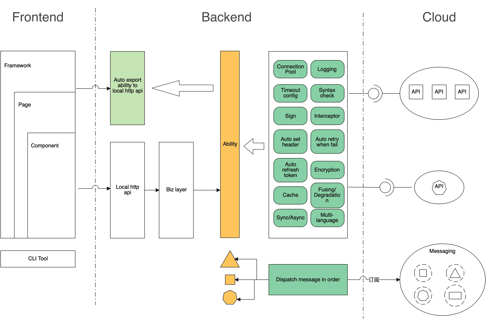
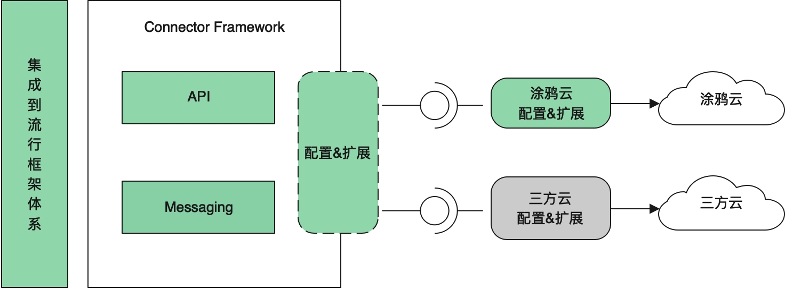
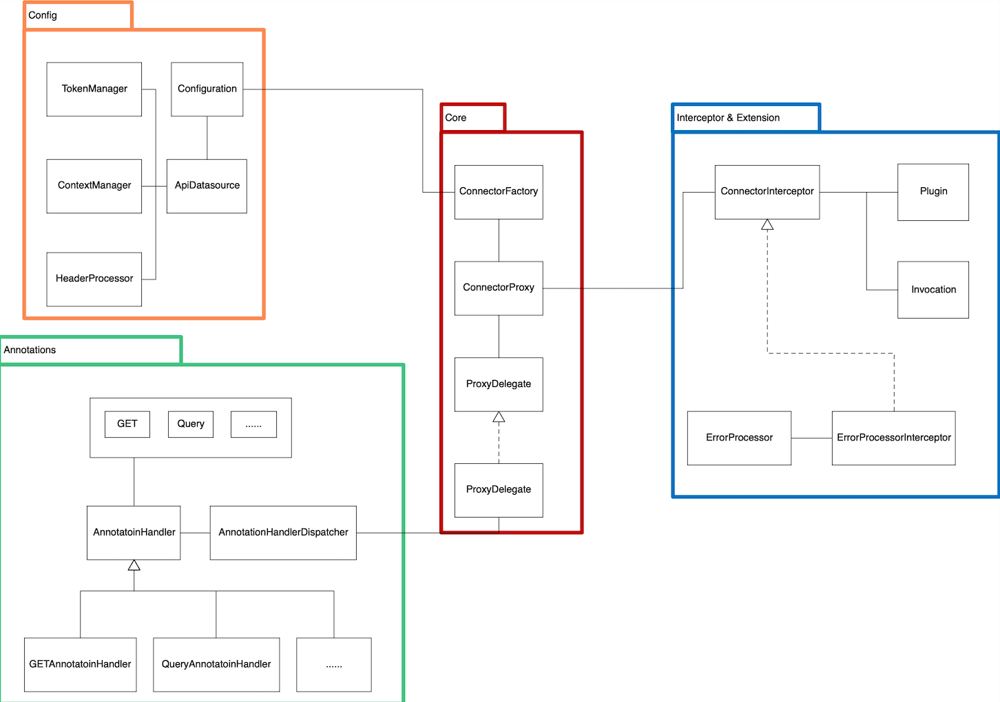

[](https://github.com/tuya/tuya-connector/blob/master/LICENSE 'License')


The `connector` framework maps cloud APIs to local APIs based on simple configurations and flexible extension mechanisms. You can subscribe to the distribution of cloud messages as local events. You can put all the focus on business logic without taking care of server-side programming nor relational databases. The OpenAPI or message subscription process is simplified, so you can focus on service logic and promote development efficiency.

### Quick start ([tuya-spring-boot-starter](https://github.com/tuya/tuya-connector) recommended for cloud development)

#### Integrate Spring Boot (recommended)

1. Configure API data source.
```
connector.api.base-url=https://www.xxx.com
```

2. Define the `Connector` API, add a scanning path, and then inject `Connector`.
```java
@ConnectorScan(basePackages = "com.xxx.connector")
@SpringBootApplication
public class DemoApplication {
    public static void main(String[] args) {
        SpringApplication.run(DemoApplication.class, args);
    }
}

public interface Connector {
    @GET("/test/{s}")
    String test(@Path("s") String s);
}

@Service
public class Service {
    @Autowired
    private Connector connector;
    
    public String test(String s) {
    	return connector.test(s);	
    }
}
```

#### Configure a generic Java project
Create a `ConnectorFactory` based on the data source configurations, load `Connector` with `ConnectorFactory` to get the `Connector` proxy, and then make API requests by using the `Connector` proxy class.
```java
public interface Connector {
    @GET("/test/{s}")
    String test(@Path("s") String s);
}

public class Demo {
	public static void main(String[] args) {
        // initialize configuration
        Configuration config = new Configuration();
        ApiDataSource dataSource = ApiDataSource.DEFAULT_BUILDER.build();
        dataSource.setBaseUrl("https://www.xxx.com");
        config.setApiDataSource(dataSource);

        // create ConnectorFactory
        ConnectorFactory connectorFactory = new DefaultConnectorFactory(config);

        // Load connector and create connector proxy
        connector = connectorFactory.loadConnector(Connector.class);

        // call API
        String result = connector.test("hello");
    }
}
```


### Features
- Centralized management of headers.
- Automatically gets and refreshes tokens.
- Return values are compatible with camel case and underscores (_).
- Return values are compatible with the generics mode. The result or <T>`T` can be returned.
- Processes error codes.
- Supports the interceptor extension.
- Exports a cloud RESTful API as a local RESTful API.
- Distributes messages and events.

### Design description
1. The cloud RESTful API is mapped to the local `Connector` API. The local `Connector` API is declared with HTTP annotations. The framework creates a proxy for the `Connector` API at runtime to process calls to the cloud RESTful API.
2. Retrofit 2 is used to process underlying requests. Similar to Retrofit 2 projects, cloud APIs are called by API operations and annotated methods.
3. Flexible extension mechanisms are supported:
   i. ContextManager
   ii. TokenManager
   iii. HeaderProcessor
   iv. ErrorProcessor
   v. ConnectorInterceptor
4. The framework can be used to sequentially subscribe to the unified cloud messaging model, parse message data, identify and construct specific message events, and then distribute local events.

### Architecture of the framework



### Core module design

#### API connector model


- **Config**

Includes the configuration items and integrated extensions, such as the URL connections, access key ID (AK) and secret access key (SK), timeout, connection pool, logs, TokenManager, HeaderProcessor, and ContextManager.

- **Core**

Implements cloud development with the Connector framework and provides the logic to process and respond to cloud RESTful API requests.

- **Annotations**

RESTful API annotations and parsing for cloud development. The following annotations are available: GET, POST, PUT, DELETE, Header, HeaderMap, Headers, Body, Query, QueryMap, Path, and Url.

| **Annotation** | **Description** | **Example** |
| --- | --- | --- |
| GET | HTTP GET method | @GET(**"/test/annotations/get"**)<br />Boolean get(); |
| POST | HTTP POST method | @POST(**"/test/annotations/post"**)<br />Boolean post(); |
| PUT | HTTP PUT method | @PUT(**"/test/annotations/put"**)<br />Boolean put(); |
| DELETE | HTTP DELETE method | @DELETE(**"/test/annotations/delete"**)<br />Boolean delete(); |
| Path | Mapping of the path parameter in the request | @GET(**"/test/annotations/path/{path_param}"**)<br />String path(@Path(**"path_param"**) String pathParam); |
| Query | Mapping between the method parameter and the query string of the request URL | @GET(**"/test/annotations/query"**)<br />String query(@Query(**"param"**) String param); |
| QueryMap | Mapping between the method parameter and the query string of the request URL | @GET(**"/test/annotations/queryMap"**)<br />String queryMap(@QueryMap  Map<String, Object> map); |
| Header | Mapping between the method parameter and the request header | @GET(**"/test/annotations/header"**)<br />String header(@Header(**"headerKey"**) String header); |
| Headers | Mapping between the annotations parameter and the request headers | @Headers(**"headerKey:headerValue"**)<br />@GET(**"/test/annotations/headers"**)<br />String headers(); |
| HeaderMap | Mapping between the method parameter and the request header | @GET(**"/test/annotations/headerMap"**)<br />String headerMap(@HeaderMap  Map<String, String> headerMap); |
| Url | Mapping between the method parameter and the request URL | @GET <br />String url(@Url String url); |
| Body | Mapping between the method parameter and the request body | @POST(**"/test/annotations/body"**)<br />String body(@Body Object body); |

- Interceptor&Extension

The extensions to the framework, including ConnectorInterceptor and ErrorProcessor.

#### Messaging connector model


- MessageDataSource
  The class to configure message data sources, such as the address, access key ID, and secret access key of the messages to be subscribed to.

- MessageDispatcher
  The message dispatcher that is used to listen for cloud messages and distribute local events in different messaging services.

- MessageEvent
  The type of message event. Each message is identified by `type`. The data structure is maintained by inheritance.

### Modules
- connector-api: connects to RESTful APIs.
- connector-messaging: subscribes to cloud messages.
- connector-spring: integrates with Spring.
- connector-spring-boot: integrates with Spring Boot.
- connector-assist: the assistant module to provide the unit test environment.

### Function plan
- Request parameters compatible with camel case and underscores (_)
- Mock mechanism
- Multiple data sources
- Multilingual support
- Circuit breaker and downgrade
- Cache
- Asynchronous processing
- Automatic generation of local code based on OpenAPI and specific plug-ins.
- Implementation for other programming languages